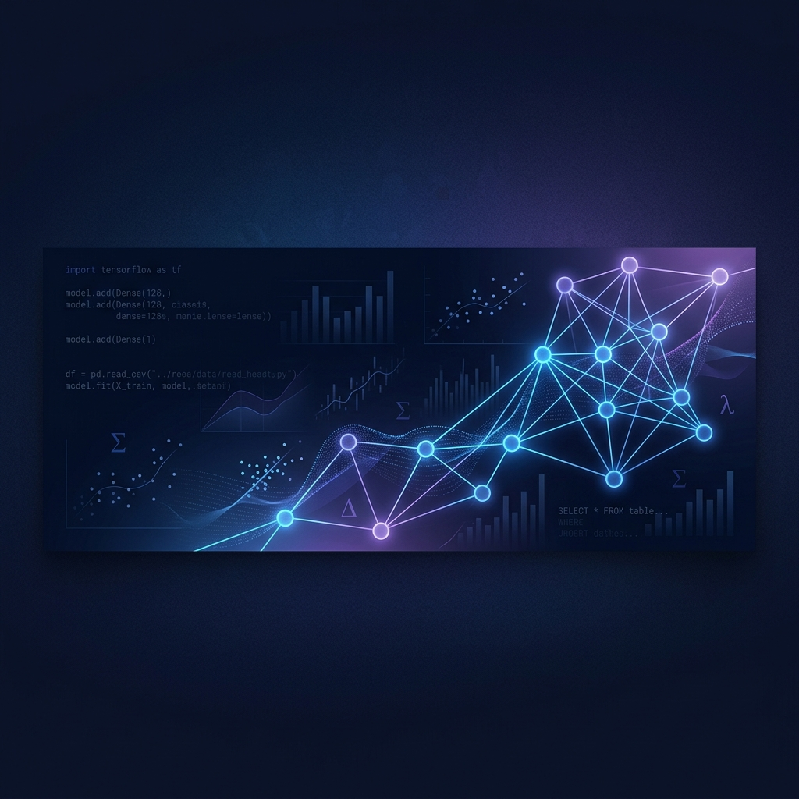

  

# Hi, I'm Rishi 👋

### Strategic Data Specialist | AI-Enhanced Analytics | Full-Stack Systems

I specialize in bridging the gap between complex data sets and actionable business insights. By **leveraging advanced AI tools** and robust automation, I build **data-driven solutions** that drive strategy and optimize operational efficiency.

---

### 🛠 Core Competencies

- **📊 Data Analysis & BI:** TSQL, Power BI, Advanced Data Modeling, Predictive Analytics
- **🤖 AI & Automation:** Python-driven Analytics, AI-Assisted Development, Workflow Optimization
- **💻 Technical Engineering:** TypeScript, Node.js, Performance Testing, Systems Architecture

---

### 🚀 Featured Insights & Projects

#### [CRM Sales Strategy & Analysis](https://github.com/RishiP44/CRM_Sales_Opportunities)
*Business Intelligence & Data Engineering*
- Developed a comprehensive analytics pipeline using **TSQL** for deep-dive sales data extraction.
- Engineered dynamic **Power BI** dashboards to identify high-value conversion opportunities and sales bottlenecks.
- **Key Outcome:** Leveraged data-driven insights to transform raw CRM metrics into strategic growth maps.

#### [AutoSales: AI-Driven Analytics](https://github.com/RishiP44/AutoSales-)
*Market Intelligence & Automation*
- Built a platform focused on **leveraging AI** for predictive sales modeling and market trend analysis.
- Automated large-scale data ingestion and processing workflows using Python.
- **Key Outcome:** Created a scalable framework for real-time market intelligence and forecasting.

#### [ProcureTask: Systems Optimization](https://github.com/RishiP44/ProcureTask)
*System Design & Business Analysis*
- Authored detailed PRDs and System Design documentation for enterprise procurement tracking.
- Focused on process mapping and user-centric architecture to streamline business operations.

---

### 📈 GitHub Ecosystem

  <!-- Profile Summary (The one currently working) -->
  

  <!-- Most Used Languages -->
  
  
  <!-- Stats Summary -->
  

---

### 📫 Let's Connect
- [LinkedIn](https://www.linkedin.com/in/YOUR_LINKEDIN_HERE)
- [Portfolio Repo](https://github.com/RishiP44/RishiP44)
